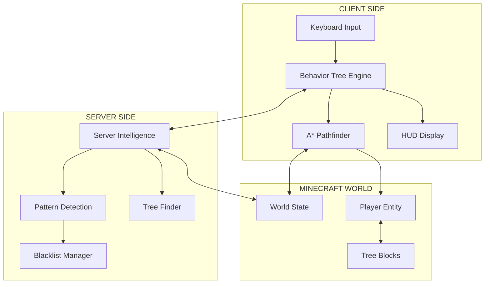

# 🏗️ Architecture - Agent.Lumber v2.6

## 🧠 **Dual-System AI Architecture**

Agent.Lumber v2.6 features a revolutionary **dual-system architecture** combining:
- **🌳 Client-Side Behavior Tree**: Handles real-time pathfinding and execution
- **🧠 Server-Side Intelligence**: Provides pattern detection and strategic guidance

---

## 🎯 **System Overview**



---

## 🌳 **Client-Side: Behavior Tree System**

### 📋 **Core Architecture**
```java
// Main behavior tree structure
BehaviorTree = new Selector(
    // Emergency handling (highest priority)
    new Sequence(
        new ConditionIsStuck(),
        new ActionResolveStuck()
    ),
    // Server intelligence integration
    new Sequence(
        new ConditionServerEmergency(),
        new ActionFollowServerRecommendation()
    ),
    // Main tree chopping logic
    new Sequence(
        new ConditionHasTarget(),
        new Selector(
            // Try to mine current target
            new Sequence(
                new ConditionHasLineOfSight(),
                new ActionMineBlock()
            ),
            // Navigate to target
            new ActionNavigateToTarget()
        )
    ),
    // Find new targets
    new ActionFindNewTree()
);
```

### 🎯 **Behavior Tree Nodes**

#### **Condition Nodes**
| Node | Purpose | Returns SUCCESS When |
|------|---------|---------------------|
| `ConditionIsStuck` | Detects movement stagnation | Player hasn't moved significantly in 3 seconds |
| `ConditionServerEmergency` | Checks server override | Server recommends emergency action |
| `ConditionHasTarget` | Validates current target | Valid tree target exists |
| `ConditionHasLineOfSight` | Checks mining feasibility | Clear path to target block |
| `ConditionPathfindingActive` | Validates navigation | A* pathfinding is currently running |

#### **Action Nodes**
| Node | Purpose | Effect |
|------|---------|--------|
| `ActionResolveStuck` | Handles stuck situations | Jumps, moves randomly, or resets |
| `ActionFollowServerRecommendation` | Executes server commands | Abandons targets, switches modes |
| `ActionMineBlock` | Breaks target blocks | Mines logs, leaves, or obstacles |
| `ActionNavigateToTarget` | Handles movement | Uses A* pathfinding to reach target |
| `ActionFindNewTree` | Locates trees | Scans for new tree targets |

### 🗺️ **A* Pathfinding System**

```java
class AStarPathfinder {
    // 3D pathfinding with intelligent costs
    public List<Vec3d> findPath(Vec3d start, Vec3d goal) {
        // Heuristic: Manhattan distance + height penalties
        // Obstacles: Solid blocks, deep water, lava
        // Optimizations: Jump costs, fall damage prevention
    }
}
```

**Path Cost Calculation:**
- **Base Movement**: 1.0 per block
- **Jumping**: +0.5 cost penalty  
- **Height Changes**: +0.2 per Y level
- **Obstacles**: +10.0 cost penalty
- **Water/Lava**: +5.0 cost penalty

---

## 🧠 **Server-Side: Intelligence System**

### 🎯 **Core Intelligence Engine**
```java
class TreeChopperAI {
    // Main AI tick - runs every game tick
    public static void onServerTick(MinecraftServer server) {
        for (ServerPlayerEntity player : getActivePlayers()) {
            AIState state = getPlayerState(player);
            AdvancedIntelligence intelligence = getPlayerIntelligence(player);
            
            // Process current task with intelligence
            processIntelligentTask(player, state, intelligence);
            
            // Detect and break problematic patterns
            detectAndBreakPatterns(state, intelligence);
        }
    }
}
```

### 📊 **Pattern Detection System**

#### **Loop Detection**
```java
// Detects repetitive behaviors that indicate AI is stuck
private boolean isInLeafClearingLoop(BlockPos target) {
    return leafClearingHistory.count(target) >= 3 &&
           timeSinceFirstAttempt(target) < 30_000; // 30 seconds
}

private boolean isInIntelligentUpgradeLoop(BlockPos target) {
    return upgradeHistory.count(target) >= 3 &&
           timeSinceFirstAttempt(target) < 60_000; // 60 seconds
}
```

#### **Movement Stagnation**
```java
// Tracks player position to detect stuck states
private boolean isPlayerStagnant(ServerPlayerEntity player) {
    List<BlockPos> recent = positionHistory.getLast(10);
    return recent.stream().distinct().count() <= 2; // Too few unique positions
}
```

### ⚡ **Ultra-Fast Timeouts**

| Timeout Type | Duration | Trigger |
|--------------|----------|---------|
| **Quick Decision** | 0.75s | Immediate response needed |
| **Stuck Detection** | 1.25s | Movement stagnation |
| **Aggressive Action** | 2.0s | Force alternative approach |
| **Complete Abandonment** | 4.0s | Give up entirely |

### 🗂️ **Advanced Blacklist System**

```java
class AdvancedIntelligence {
    // Permanent learning from failures
    public void blacklistTarget(BlockPos target, String reason) {
        blacklistedTargets.add(target);
        blacklistReasons.put(target, reason);
        targetAttemptCounts.put(target, 0); // Reset attempts
        
        logger.info("Target blacklisted: " + target + " - " + reason);
    }
    
    // Pattern-based blacklisting  
    public void analyzeAndBlacklist(AIState state) {
        if (isInLeafClearingLoop(state.targetTree)) {
            blacklistTarget(state.targetTree, "Leaf-clearing loop detected");
            forcedExplorationMode = true;
        }
    }
}
```

---

## 🔗 **Client-Server Integration**

### 📡 **Communication Protocol**

#### **Server → Client Messages**
```java
// Server sends intelligence recommendations to client
public static Vec3d getActiveTarget(ClientPlayerEntity player) {
    // Returns current server-recommended target
}

public static BlockPos getCurrentMiningTarget(ClientPlayerEntity player) {
    // Returns specific block to mine
}

public static boolean isEmergencyModeActive(ClientPlayerEntity player) {
    // Returns if server wants emergency action
}
```

#### **Client → Server Updates**
```java
// Client reports progress to server
public static void reportMiningProgress(BlockPos target, float progress) {
    // Updates server on mining completion percentage
}

public static void reportStuckState(String reason) {
    // Informs server when client detects stuck behavior
}

public static void reportTargetAbandoned(BlockPos target, String reason) {
    // Notifies server when client gives up on target
}
```

### 🔄 **Synchronization Strategy**

1. **Server Leads**: Server intelligence makes strategic decisions
2. **Client Executes**: Client behavior tree handles real-time execution  
3. **Feedback Loop**: Client reports results back to server intelligence
4. **Emergency Override**: Server can instantly redirect client when needed

---

## 🎮 **HUD System Architecture**

### 📺 **Display Components**
```java
private void updateHUD(MinecraftClient client) {
    hudMessages.clear();
    
    // Header with branding
    hudMessages.add("§b§lAgent.Lumber v2.0 (Advanced + Intelligence)§r");
    
    // Status section
    hudMessages.add(isActive ? "§a● STATUS: ACTIVE" : "§c● STATUS: INACTIVE");
    hudMessages.add("§e§lSTATE: " + currentBehaviorState);
    
    // Target information
    if (hasTarget) {
        hudMessages.add("§6§lTREE TARGET: " + formatPosition(treeTarget));
        hudMessages.add("§c§lMINING TARGET: " + formatPosition(miningTarget));
    }
    
    // Pathfinding status
    if (pathfindingActive) {
        hudMessages.add("§d§lPATHFINDING: A* Route Active");
        hudMessages.add("§f§lWAYPOINTS: " + currentWaypoint + "/" + totalWaypoints);
    }
    
    // Server intelligence status
    hudMessages.add("§a§lSERVER INTELLIGENCE: " + serverThinkingState);
    if (forcedExplorationMode) {
        hudMessages.add("§e§lEXPLORATION MODE: Expanded search radius");
    }
}
```

### 🎨 **Color Coding System**
- **§b (Aqua)**: Headers and branding
- **§a (Green)**: Active/successful states  
- **§c (Red)**: Inactive/error states
- **§e (Yellow)**: Current actions/states
- **§6 (Gold)**: Target information
- **§d (Light Purple)**: Pathfinding data
- **§f (White)**: Detailed information

---

## ⚡ **Performance Optimizations**

### 🔧 **Client-Side Optimizations**
- **Behavior Tree Caching**: Node results cached for 5 ticks
- **A* Path Reuse**: Paths cached until target changes
- **HUD Throttling**: Updates limited to 4 times per second
- **Input Debouncing**: Key presses limited to prevent spam

### 🧠 **Server-Side Optimizations**  
- **Intelligent Batching**: Player processing spread across ticks
- **Pattern Caching**: Detection results cached for 20 ticks
- **Blacklist Pruning**: Old entries removed after 10 minutes
- **Memory Management**: Position history limited to 50 entries

### 📊 **Performance Metrics**
- **Total Memory**: ~5-10MB additional RAM usage
- **CPU Impact**: ~2-3% on modern systems
- **Network Usage**: <1KB/second for coordination messages
- **FPS Impact**: <1-2 FPS reduction in most scenarios

---

## 🚀 **Scalability & Extensibility**

### 🔧 **Adding New Behavior Tree Nodes**
```java
// Create custom condition
class ConditionCustom implements BTNode {
    @Override
    public BTStatus tick(MinecraftClient client, AIContext context) {
        // Your custom logic here
        return BTStatus.SUCCESS; // or FAILURE/RUNNING
    }
}

// Add to behavior tree
new Sequence(
    new ConditionCustom(),
    new ActionCustomResponse()
)
```

### 🧠 **Extending Server Intelligence**
```java
// Add new pattern detection
private boolean isInCustomLoop(BlockPos target) {
    // Your pattern detection logic
    return customPattern.detected(target);
}

// Integration with main intelligence
if (intelligence.isInCustomLoop(state.targetTree)) {
    intelligence.blacklistTarget(state.targetTree, "Custom pattern detected");
    // Take corrective action
}
```

---

## 🎯 **Architecture Benefits**

### ✅ **Dual-System Advantages**
- **🔄 Real-time Responsiveness**: Client handles immediate actions
- **🧠 Strategic Intelligence**: Server provides long-term planning
- **⚡ Emergency Override**: Instant recovery from problematic states
- **📊 Comprehensive Learning**: Permanent pattern recognition and avoidance

### 🌟 **Professional Game AI**
- **🏗️ Modular Design**: Easy to extend and modify
- **🎯 Hierarchical Logic**: Clear priority systems
- **🔧 Maintainable Code**: Clean separation of concerns
- **📈 Scalable Architecture**: Supports multiple AI instances

**Agent.Lumber v2.6 represents the pinnacle of Minecraft AI development - combining academic behavior tree theory with practical game intelligence!** 🚀 